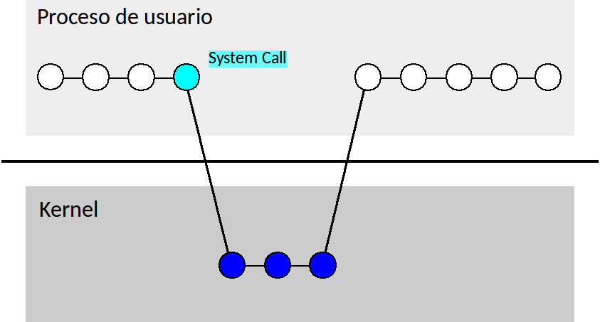

Hemos visto la evolución de los sistemas de cómputo desde el punto de vista del hardware, y cómo llegaron a soportar varios usuarios corriendo varias aplicaciones, todo sobre un mismo equipamiento.

Ahora veremos de qué manera evolucionó el software asociado a esos sistemas de cómputo para permitir que esos diferentes usuarios y esas diferentes aplicaciones pudieran compartir el hardware sin ocasionarse problemas unos a otros, y obteniendo el máximo rendimiento posible del equipamiento. 

La pieza que falta en este complejo mecanismo es el <b>sistema operativo</b>, un software básico cuya función principal es la de ser intermediario entre los usuarios y el hardware del sistema de cómputo.

###Open Shop

Las primeras computadoras estaban dedicadas a una única tarea, perteneciente a un único usuario. Podían ser utilizadas por diferentes usuarios, pero cada uno debía esperar su turno para reprogramarlas manualmente, lo cual era laborioso y se llevaba gran parte del tiempo por el cual esos usuarios pagaban.

###Sistemas Batch

Una vez que se popularizaron las máquinas de programa almacenado, se pudo minimizar el tiempo ocioso adoptando **esquemas de carga automática** de trabajos. 
Un trabajo típico consistía en la compilación y ejecución de un programa, o la carga de un programa compilado más un lote de datos de entrada, y la impresión de un cierto resultado de salida del programa. 
Estos trabajos estaban definidos por conjuntos o lotes de tarjetas perforadas, de ahí su nombre de trabajos **por lotes** o, en inglés, *batch*. 

###Sistemas Multiprogramados

Más adelante, conforme las tecnologías permitían ir aumentando la velocidad de procesamiento, se notó que los procesadores quedaban desaprovechados gran parte del tiempo debido a la inevitable **actividad de entrada/salida**. Así se idearon sistemas que optimizaban la utilización de la CPU, al poderse cargar más de un programa en la memoria y poder conmutar el uso del procesador entre ellos. Éstos fueron los primeros **sistemas multiprogramados**.

###Sistemas de Tiempo Compartido

Una vez que llegó la posibilidad de tener varios programas coexistiendo simultáneamente en la memoria, se buscó que la conmutación del uso del procesador entre ellos fuera tan rápida, que pareciera que cada programa funcionaba sin interrupciones. Aunque el sistema era de **tiempo compartido**, el usuario utilizaba la computadora como si estuviera dedicada exclusivamente a correr su programa. Así los sistemas multiprogramados se volvieron **interactivos**.

###Computacíon personal
Todas éstas fueron innovaciones de software, y fueron estableciendo principios y técnicas que serían adoptadas en lo sucesivo. Con la llegada de la computación personal, los sistemas de cómputo eran de capacidades modestas. Los **sistemas operativos** que permitían la ejecución de aplicaciones de los usuarios en estos sistemas de cómputo comenzaron pudiendo correr una sola aplicación por vez y de un solo usuario; es decir, se trataba de sistemas **monotarea** y **monousuario**. 

Sin embargo, con la industria de las computadoras personales y la del software para computadoras personales traccionándose una a la otra, aparecieron sistemas operativos **multiusuario** y **multitarea**, sumamente complejos, que se convirtieron en un nuevo terreno para ensayar y mejorar las tecnologías de software y hardware.

##Componentes del SO
Los modernos sistemas operativos tienen varios componentes bien diferenciados. 
Los sistemas operativos de propósito general normalmente se presentan en una **distribución** que contiene e integra al menos tres componentes.

- **Kernel** 

    El componente que constituye el sistema operativo propiamente dicho es el llamado **núcleo** o **kernel**. 

- **Software de sistema**

    Junto al kernel es habitual encontrar un conjunto de **programas utilitarios o software de sistema**, que no es parte del sistema operativo, estrictamente hablando, pero que en general es indispensable para la administración y mantenimiento del sistema. 

- **Interfaz de usuario** 

    También se encuentra junto a este software del sistema alguna forma de **interfaz de usuario**, que puede ser gráfica o de caracteres. Esta interfaz de usuario se llama en general **shell**, especialmente cuando la interfaz es un procesador de comandos, basado en caracteres, y los comandos se tipean.

###Sistemas empotrados o embebidos

Hay algunas excepciones a esta estructura de componentes, por ejemplo, en los sistemas operativos **empotrados** o **embebidos** (*embedded systems*), que están ligados a un dispositivo especial y muy específico, como es el caso de algunos robots, instrumental médico, routers, electrodomésticos avanzados, etc.
 
Estos sistemas operativos constan de un kernel que tiene la misión de hacer funcionar cierto hardware especial, pero no necesariamente incluyen una interfaz de usuario (porque el usuario no necesita en realidad comunicarse directamente con ellos) o no incluyen software de sistema porque sus usuarios no son quienes se encargan de su mantenimiento.

##Aplicaciones

Un típico sistema operativo multipropósito, actual, debe dar soporte entonces a la actividad de una gran variedad de aplicaciones. No solamente a la interfaz de usuario o procesador de comandos, más el software de sistema incluido, sino también a toda la gama de aplicaciones que desee ejecutar el usuario, como programas de comunicaciones (navegadores, programas de transferencia de archivos, de mensajería); aplicaciones de desarrollo de programas (compiladores, intérpretes de diferentes lenguajes).

##Kernel
El **kernel** o núcleo es esencialmente un conjunto de rutinas que permanecen siempre residentes en memoria mientras la computadora está operando. Estas rutinas intervienen en todas las acciones que tengan que ver con la operación del hardware. 

###Recursos
El kernel funciona no solamente como un mecanismo de administración y control del hardware o conjunto de **recursos físicos**, sino también de ciertos recursos del sistema que son **lógicos**, como los archivos. Además tiene la capacidad de poner en ejecución a los programas que se encuentran en el sistema. 

###Procesos
Cuando un programa está en ejecución, lo llamamos un **proceso**. El sistema operativo controla la creación, ejecución y finalización de los procesos.

###Llamadas al sistema o system calls
El kernel ofrece su capacidad de control de todos los recursos a los procesos o programas en ejecución, quienes le solicitan determinadas operaciones sobre esos recursos. Por ejemplo, un proceso que necesita utilizar un dispositivo de entrada/salida, o un recurso lógico como un archivo, hace una **petición o llamada al sistema** solicitando un servicio al sistema operativo. El servicio puede tratarse de una operación de lectura, escritura, creación, borrado, etc. El sistema operativo centraliza y coordina estas peticiones de forma que los procesos no interfieran entre sí.

###Modo privilegiado
Si los procesos de usuario pudieran utilizar los recursos en cualquier momento y sin coordinación, los resultados podrían ser desastrosos. Por ejemplo, si dos o más programas quisieran usar la impresora al mismo tiempo, en el papel impreso se vería una mezcla de las salidas de los programas que no serviría a ninguno de ellos.

Como el sistema operativo debe coordinar el acceso de los diferentes procesos a esos recursos, resulta necesario que cuente con alguna forma de imponer conductas y límites a esos usuarios y programas, para evitar que ellos tomen control del sistema en perjuicio de los demás. Para garantizarle este poder por sobre los usuarios, el sistema operativo requiere apoyo del hardware: su código se ejecuta en un modo especial de operación del hardware, el **modo privilegiado** del procesador.

###Modo dual de operación

Los modernos procesadores funcionan en lo que llamamos **modo dual** de ejecución, donde el ISA se divide en dos grupos de instrucciones. 

- Ciertas instrucciones que controlan el modo de operación de la CPU, el acceso a memoria, o a las unidades de Entrada/Salida, pertenecen al grupo de instrucciones del **modo privilegiado**. 
- Un programa de usuario que se está ejecutando funciona en modo **no privilegiado**, donde tiene acceso a la mayoría de las instrucciones del ISA, pero no a las instrucciones del modo privilegiado. 

El procesador ejecutará instrucciones del programa en ejecución en modo no privilegiado hasta que éste necesite un servicio del sistema operativo, tal como el acceso a un recurso físico o lógico.

Para requerir este servicio, el proceso ejecuta una instrucción de **llamada al sistema** o **system call**, que es la única instrucción del conjunto no privilegiado que permite a la CPU conmutar al modo privilegiado.

La llamada al sistema conmuta el modo de la CPU a modo privilegiado **y además** fuerza el salto a una cierta dirección fija de memoria donde existe código del kernel. En esa dirección de memoria existe una rutina de atención de llamadas al sistema, que determina, por el contenido de los registros de la CPU, qué es lo que está solicitando el proceso. 

Con estos datos, esa rutina de atención de llamadas al sistema dirigirá el pedido al subsistema del kernel correspondiente, ejecutando siempre en modo privilegiado, y por lo tanto, con completo acceso a los recursos.
</section>
<section data-transition="fade-in slide-out">
<h2>Modo de ejecución dual</h2>

El subsistema que corresponda hará las verificaciones necesarias para cumplir el servicio: 

* El usuario dueño del proceso, ¿tiene los permisos necesarios?
* El recurso, ¿está disponible o está siendo usado por otro proceso?, etc.

Si se cumplen todos los requisitos, se ejecutará el servicio pedido y luego se volverá a modo usuario, a continuar con la ejecución del proceso.  

##Ejecución de aplicaciones
Al ejecutar procesos de usuario o de sistema se pone en juego una jerarquía de piezas de software que ocupa varios niveles. 

Normalmente, cualquier aplicación que funcione en el sistema, ya sean las del sistema o las generadas por el usuario, competirá con las demás por los recursos en igualdad de condiciones.

Todas las aplicaciones, en algún momento, requieren funciones que ya están preparadas para su uso y almacenadas en **bibliotecas** especializadas en algún área.

Algunas aplicaciones pueden requerir funciones matemáticas; otras, de gráficos; algunas, de comunicaciones. Todas ellas requerirán, sin duda, funciones de entrada/salida. Cada grupo de estas funciones está encapsulado en una o varias bibliotecas que forman parte del sistema. 

La **vinculación** de los programas de usuario con las bibliotecas puede hacerse al tiempo de compilación o, cuando las bibliotecas son **de carga dinámica**, al tiempo de ejecución.

Al ejecutarse los procesos, normalmente las bibliotecas necesitan recurrir a servicios del kernel para completar su funcionamiento. Los diferentes subsistemas del kernel se ocupan de cada clase de servicios y de manejar diferentes clases de recursos. 

Por ejemplo:

- Si un proceso necesita solicitar más memoria durante la ejecución, la pedirá al subsistema de **gestión de memoria**. 
- Cada vez que un proceso escriba datos en un archivo, estará comunicándose,  a través de una biblioteca, con el subsistema de **gestión de archivos**.
- Si un proceso necesita enviar o recibir datos a través de la red, el kernel pondrá en funcionamiento el **driver** de la interfaz de red, la pieza de software que sabe comunicarse con ese hardware.

La comunicación entre los procesos de usuario y sus bibliotecas, por un lado, y el kernel y sus subsistemas, por otro, se produce cuando ocurre una llamada al sistema o system call. Es en este momento cuando se cruza el límite entre modo usuario y modo privilegiado, o espacio de usuario y espacio del kernel.

##Una cronología de los SO
Entre la década de 1960 y principios del siglo XXI surgieron gran cantidad de innovaciones tecnológicas en el área de sistemas operativos. Muchas de ellas han tenido éxito más allá de los fines experimentales y han sido adoptadas por sistemas operativos con gran cantidad de usuarios. Diferentes sistemas operativos han influido en el diseño de otros posteriores, creándose así líneas genealógicas de sistemas operativos.

Es interesante seguir el rastro de lo que ocurrió con algunos sistemas importantes a lo largo del tiempo, y ver cómo han ido reconvirtiéndose unos sistemas en otros. 

- Por ejemplo, el sistema de archivos diseñado para el sistema operativo CP/M de la empresa Digital, en los años 70, fue adaptado para el MS-DOS de Microsoft, cuya evolución final fue **Windows**. 

    Los diseñadores de Windows NT fueron los mismos que construyeron el sistema operativo VMS de los equipos VAX, también de Digital, y aportaron su experiencia. De hecho, muchas características de la gestión de procesos y de entrada/salida de ambos sistemas son idénticas.

- Otra importante línea genealógica es la que relaciona el antiguo Multics, por un lado, con **Unix** y con Linux; y más recientemente, con el sistema para plataformas móviles Android. 

    Unix fue el primer sistema operativo escrito casi totalmente en un lenguaje de alto nivel, el **C**, lo cual permitió portarlo a diferentes arquitecturas. Esto le dio un gran impulso y la comunidad científica lo adoptó como el modelo de referencia de los sistemas operativos de tiempo compartido.

    En 1991 **Linus Torvalds** lanzó un proyecto de código abierto dedicado a la construcción de un sistema operativo compatible con Unix pero sin hacer uso de ningún código anteriormente escrito, lo que le permitió liberarlo bajo una [licencia libre](https://es.m.wikipedia.org/wiki/Software_libre). La consecuencia es que Linux, su sistema operativo, rápidamente atrajo la atención de centenares de desarrolladores de todo el mundo, que sumaron sus esfuerzos para crear un sistema que fuera completo y disponible libremente. 

    Linux puede ser estudiado a fondo porque su código fuente no es secreto, como en el caso de los sistemas operativos propietarios. Esto lo hace ideal, entre otras cosas, para la enseñanza de las Ciencias de la Computación. Esta cualidad de sistema abierto permitió que otras compañías lo emplearan en muchos otros proyectos.

- Otra empresa de productos de computación de notable trayectoria, **Apple**, produjo un sistema operativo para su línea de computadoras personales Macintosh. Su sistema MacOS estaba influenciado por desarrollos de interfaces de usuario gráficas realizadas por otra compañía, Xerox, y también derivó en la creación de un sistema operativo para dispositivos móviles. 

- Otros sistemas operativos han cumplido un ciclo con alguna clase de final, al no superar la etapa experimental, haberse transformado definitivamente en otros sistemas, desaparecer del mercado o quedar confinados a cierto nicho de aplicaciones. Algunos, por sus objetivos de diseño, son menos visibles, porque están destinados a un uso que no es masivo, como es el caso del **sistema de tiempo real** QNX. 

##Servicios del SO
Después de conocer estas cuestiones generales sobre los sistemas operativos, veremos con un poco más de detalle los diferentes **servicios** provistos por los principales subsistemas de un SO:

- Ejecución de procesos
- Gestión de archivos
- Operaciones de Entrada/Salida
- Gestión de memoria
- Protección

Si bien la discusión que sigue es suficientemente general para comprender básicamente el funcionamiento de cualquier sistema operativo moderno, nos referiremos sobre todo a la manera como se implementan estos subsistemas y servicios en la familia de sistemas **Unix**, que, como hemos dicho, es el modelo de referencia académico para la mayoría de la investigación y desarrollo de sistemas operativos.

##Ejecución de procesos

¿Cómo se inicia la ejecución de un proceso? Todo proceso es **hijo** de algún otro proceso que lo crea. 

###Creación de procesos
Inicialmente, el SO crea una cantidad de procesos de sistema. Uno de ellos es una **interfaz de usuario o shell**. Este proceso sirve para que el usuario pueda comunicarse con el SO y solicitarle la ejecución de otros procesos.

El *shell* puede ser gráfico, con una interfaz de ventanas, o de texto, con un intérprete de comandos. En cualquiera de los dos casos, de una forma u otra el usuario selecciona **programas** que están residiendo en algún medio de almacenamiento como los discos, y pide al SO que ejecute esos programas.

En respuesta, el SO carga esos programas en memoria y pone a la CPU a ejecutar el código de esos programas. Una vez en ejecución, decimos que tenemos un nuevo **proceso** en el sistema. Este nuevo proceso es un hijo del shell, y a su vez puede crear nuevos procesos hijos si es necesario.

###Estados de los procesos
Durante su vida, el proceso atravesará diferentes **estados**. Un proceso puede no estar siempre en estado de ejecución (utilizando la CPU), sino que en un momento dado puede pasar a otro estado, quedando transitoriamente suspendido, para dejar que otro proceso utilice la CPU.

###Scheduler o planificador
El ciclo de cambios de estado de los procesos es administrado por un componente esencial del SO, el **scheduler** o **planificador**, que lleva el control de qué proceso debe ser el próximo en ejecutarse. El planificador elige qué proceso pasar a estado de ejecutando, siguiendo una estrategia que permita obtener el máximo rendimiento posible de la CPU. Al elegir un nuevo proceso para ejecutar, el que estaba ejecutándose cambia de estado hasta que vuelva a tocarle el uso de la CPU.

**Planificación de tiempo compartido**

Como el planificador de los SO **de tiempo compartido** es capaz de hacer estos cambios de estado con mucha velocidad, normalmente el resultado es que sus usuarios no perciben estos cambios de estado. Los sistemas de tiempo compartido fueron creados para ser **interactivos**, y tienen la misión de hacer creer a cada usuario que el sistema de cómputo está dedicado exclusivamente a sus procesos.

Sin embargo, normalmente existen muchísimos procesos vivos simultáneamente en un SO de propósito general. 

###Concurrencia y paralelismo
Si el sistema de tiempo compartido dispone de **una sola unidad de ejecución o CPU**, habrá solamente **un proceso ejecutándose** en cada momento dado, pero muchos procesos podrán desarrollar su vida al mismo tiempo, alternándose en el uso de esa CPU. 

- Cuando los procesos viven en el sistema simultáneamente pero se alternan en el uso de **una única CPU** decimos que esos procesos son **concurrentes**. Todos coexisten en el sistema durante un período de tiempo dado; sin embargo, no hay dos procesos en estado de ejecución en el mismo momento, por lo cual no podemos decir que se ejecutan "simultáneamente".
- Cuando el sistema de cómputo tiene más de una CPU, entonces podemos tener dos o más procesos en estado de ejecución **simultáneamente**, y entonces decimos que esos procesos son **paralelos**. Para tener paralelismo, además de concurrencia debemos tener **redundancia de hardware** (es decir, más de una CPU).

Supongamos un sistema donde existen dos procesos activos, con algunas páginas en memoria principal, y una zona de intercambio en disco.

El proceso P1 tiene asignadas cuatro páginas (de las cuales sólo la página 2 está presente en memoria principal), y P2, dos páginas (ambas presentes). Hay tres marcos libres (M4, M6 y M7) y la zona de intercambio está vacía.

P1 recibe la CPU y en algún momento ejecuta una instrucción que hace una referencia a una posición dentro de su página 3 (que no está en memoria). 

Ocurre una falta de página que trae del almacenamiento la página 3 de P1 a un marco libre. La página 3 se marca como presente en la tabla de páginas de P1.

Enseguida ingresa P3 al sistema y comienza haciendo una referencia a su página 2. 

Como antes, ocurre una falta de página, se trae la página 2 de P3 del disco, y se copia en un marco libre. Se marca la página 2 como presente y P3 continúa su ejecución haciendo una referencia a una dirección que queda dentro de su página 3.

Se resuelve como siempre la falta de página para la página 3 y P3 hace una nueva referencia a memoria, ahora a la página 4.

Pero ahora la memoria principal ya no tiene marcos libres. Es el momento de elegir una página víctima para desalojarla de la memoria. Si la página menos recientemente usada es la página 2 de P1, es una buena candidata. En caso de que se encuentre modificada desde que fue cargada en memoria, se la copia en la zona de intercambio para no perder esas modificaciones, y se declara libre el marco M2 que ocupaba.

Se marca como <b>no presente</b> la página que acaba de salir de la memoria principal.

Se copia la página que solicitó P3 en el nuevo marco libre, se la marca como presente en la tabla de páginas de P3, y el sistema continúa su operación normalmente.

Este emulador de PC construido en Javascript nos permite practicar los comandos del shell dentro de una *máquina virtual* Linux y desde el navegador, sin necesidad de una instalación completa en nuestro equipo.

* Para retroceder en el terminal
  - Teclas Ctrl-Up, Ctrl-Down, Ctrl-PageUp y Ctrl-PageDown.
* Para copiar datos a la máquina virtual
  - Copiar el texto a la caja o **clipboard** a la derecha.
  - En el shell de la máquina virtual escribir:
        cat < /dev/clipboard > /tmp/archivo
  - Ahora tenemos ese mismo texto en el archivo /tmp/archivo.
* Para extraer datos de la máquina virtual
  - Invertir el procedimiento anterior: 
        cat mi_archivo > /dev/clipboard
  - Seleccionar el texto en la caja **clipboard** y copiarlo a alguna otra aplicación en nuestro equipo, tal como un editor.

