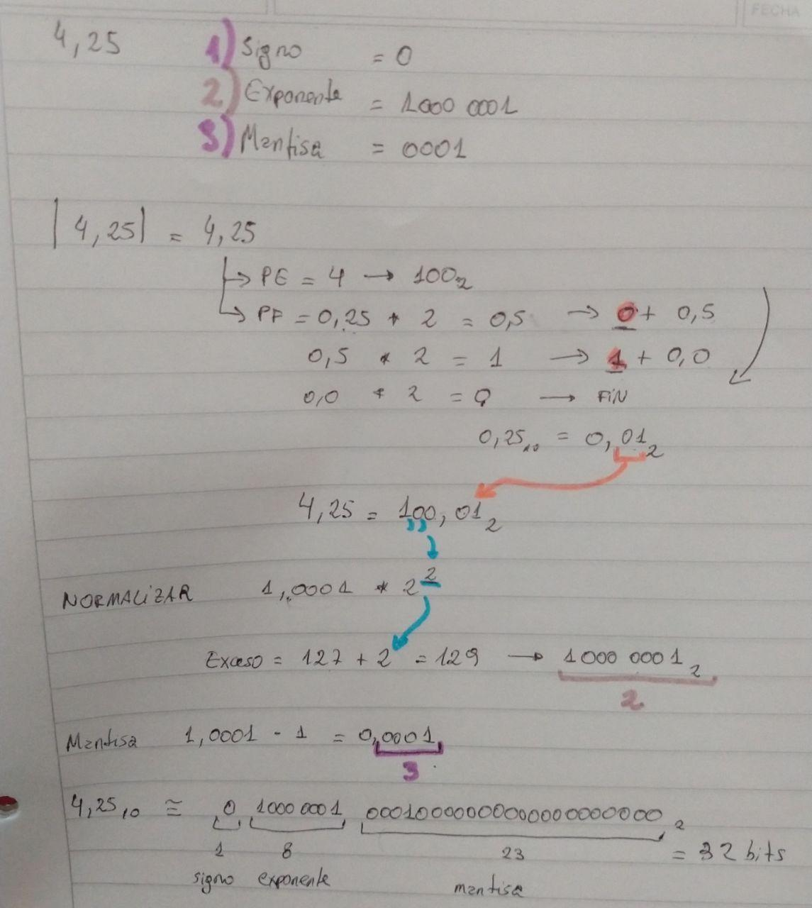

# Resolución ejercicio de punto flotante

Estimados alumnos y alumnas 

Hemos realizado un video resolviendo un ejemplo del tema **"Representación de
datos numéricos"**

El ejercicio del video es el siguiente:

-   Convertir del sistema decimal a la notación Punto Flotante IEEE-754 de
    precisión simple (32 bits) el número 4,25.

En el _TP02_ los ejercicios equivalentes son los de la sección **3: Representación
de Números Reales**, en particular el **ejercicio 4**.

En el [apunte de la materia](https://se.fi.uncoma.edu.ar/IC/IC-notes-2020.pdf)
pueden leer al respecto en la **sección 3.10**, que comprende las **páginas 42
a 47**.

Enlace al video: [https://youtu.be/D20f-_077_A](https://youtu.be/D20f-_077_A)

Resolución completa del ejercicio:

